# RTL Design  in Verilog using SKY130 Technology


## Project Scope

The project provides a detailed account of the 5-day workshop facilitated by VSD on RTL Design in Verilog using the SKY130 Technology. 

SKY130 is the hardware industry's first open-source process design kit (PDK) released by SkyWater Technology Foundry in collaboration with Google giving all hardware design experts and aficionados, a worldwide access to their IP functions and open source ASICs. More details [here.](https://github.com/google/skywater-pdk)

This particular workshop covers the various aspects of design in Verilog HDL both theoretically and practically with labs using open-source softwares through their VSD-IAT portal. Beginning with an introduction to digital design using Verilog HDL, the instructors cover digital design steps that include design, functional simulation, test bench based validation of the design functionality and logic Synthesis with optimization. Further, we learn about efficient verilog coding styles that result in a predictable logic in Silicon. 


## Getting Started

Users interested in practicing design using open-source tools need a Linux based OS and a host of open source EDA tools. More information regarding the installation and scripts can be found in the free UDemy tutorial [here.](https://www.udemy.com/course/vsd-a-complete-guide-to-install-open-source-eda-tools/?src=sac&kw=VSD+-+A+complete+guide+to)

Basic knowledge of Verilog HDL is required to follow the content without any difficulties

---
## Day 1 -  Introduction to Verilog RTL Design and Synthesis

The first day covers the basics of RTL Design, Testbench, Simulation and Synthesis. Open-Source softwares like iverilog (simulator) and YOSYS (Synthesis) are provided through remote access in the portal to practice labs.

RTL Design -  It consists of an actual verilog code / a set of verilog codes that have the functionality to meet the required design specifications of the circuit
TestBench - Testbench is a setup that one uses to apply a set of stimuli (test-case vector) to check the functional working of the design file

We do the above processes using a simulator software. The simulator is loaded with the design and its respective testbench file after which it looks for changes in the input signals and depending on the change, the output is evaluated. These changes in input and corresponding output values are dumped in a special format file called "value change dump" (.vcd) file. This file can be pictorially represented in waveforms using a waveform tool like gtkwave. 

### Part 1 -  Setup the lab instance with libraries and verilog files

Firstly, we have to clone 2 separate repositories namely [vsdflow](https://github.com/kunalg123/vsdflow) and [sky130RTLDesignAndSynthesisWorkshop](https://github.com/kunalg123/sky130RTLDesignAndSynthesisWorkshop) which contain the required library files and verilog design files to perform the simulations and logic synthesis parts of the workshop. It can be done using basic linux command gitclone ex: git clone https://github.com/kunalg123/vsdflow.git .
We are given a default set of files and libraries shown below to work on using the practical lab instance


### Part 2 - Simulation using iverilog simulator - 2:1 multiplexer rtl design

After cloning the respective repositories in our lab instance, we perform a simulation run of 2:1 multiplexer rtl file namely good_mux.v and its corresponding testbench file tb_good_mux.v to obtain .vcd files and analyze the waveform in gtkwave to see the change in output instances with respect to change in input values. 

#### Verilog file of a simple 2:1 multiplexer


#### Verilog testbench file of the corresponding 2:1 multiplexer with stimuli


#### Simulation results using iverilog simulator


#### Waveform using gtkwave


### Part 3 -  Synthesis using YOSYS open-source tool

After simulation of the rtl design with the respective testbench, we perform a synthesis of the design using Synthesizer. A Synthesizer is a tool used to convert the RTL Design into a netlist file (Standard Cell Format). To be more specific, a **netlist** is a standard gate level file that consists of nets, sequential and combinational cells and their connectivity of the corresponding RTL file coded using a HDL. In simple words, an rtl file is a code that describes the functionality of the design and a netlist is a file that expresses the same code in the form of logic cells like logic gates, flipflops, multiplexers with net connections etc. 

Here, we use a synthesizer tool called [YOSYS](https://github.com/YosysHQ/yosys) which is a part of Qflow (open-source) tool chain for complete RTL2GDS transformation. The basic input files to YOSYS include the RTL Design file and .lib (library) files. 

**What is a .lib file?**

--> .lib files are a collection of logical modules which include logic gates like AND, OR, NOT, NAND, NOR etc. Each logic gate is stored in one or more flavours depending on the number of inputs and speed of the circuit (slow, fast & medium). 

Why do we need different flavours of the same logic gate?

--> Combinational delays present in a logic path determine the maximum speed and performance of a logic circuit. For Example, to get a maximum performance from a circuit, we need to design the circuit with minimum clock delays. 

Inorder to obtain minimum clock delays, we require very fast cells to minimize the clock delays. 

In the same way, inorder to avoid Hold violations in a logic path, we have to use SLOW cells to synchronize the hold time for logic path. 

All these different types of fast and slow cells are present in a .lib file to be used by the synthesis software tool

#### Faster Cells vs Slower Cells

A cell delay in the digital logic circuit depends on the load of the circuit which here is Capacitance. 

Faster the charging / discharging of the capacitance --> Lesser is the Cell Delay

Inorder to charge/discharge the capacitance faster, we use wider transistors that can source more current. This will help us reduce the cell delay but at the same time, wider transistors consumer more power and area. Similarly, using narrower transistors help in reduced area and power but the circuit will have a higher cell delay. Hence, we have to compromise on area and power if we are to design a circuit with low cell delay.

#### Constraints 

A Constraint is a guidance file given to a synthesizer inorder to enable an optimum implementation of the logic circuit by selecting the appropriate flavour of cells (fast or slow). 

#### Practical Synthesis using YOSYS

We perform a synthesis of the 2:1 Multiplexer RTL design using YOSYS with appropriate library files from SKY130 technology that we cloned into the directory. 

Coding scripts for Synthesis using YOSYS

```
$yosys                                                                             --> invokes YOSYS tool

yosys> read_liberty -lib ../my_lib/lib/sky130_fd_sc_hd__tt_025C_1v80.lib           --> reads the corresponding library file

yosys> read_verilog good_mux.v                                                     --> reads the Verilog script

yosys> synth -top good_mux                                                         --> reads the top level module

yosys> abc -lib ../my_lib/lib/sky130_fd_sc_hd__tt_025C_1v80.lib                    --> converts the logic file to netlist

yosys> show                                                                        --> Final netlist output display
```

#### Screenshots of the Sysnthesis procedure using YOSYS

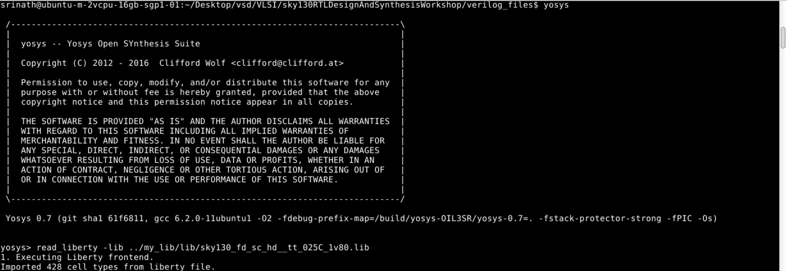

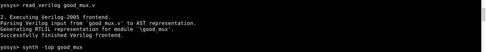

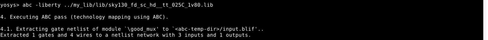

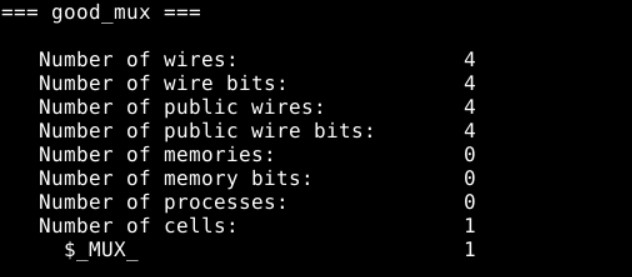

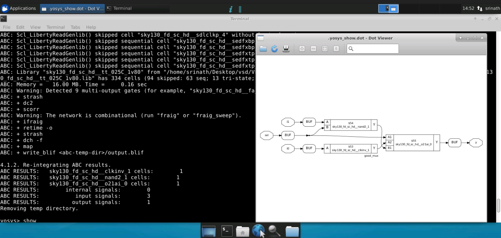

The final sysnthesized netlist shows that the 2:1 multiplexer RTL is translated to a gate level representation using buffers, 2 input NAND gate , and OR gate and an o21ai_0 (OR,AND  & NOT gate) 

----

## Day 2 - Timing libs, Hierarchical vs Flat Synthesis & Efficient FlipFlop coding styles

### Part 1 - More about the .lib file

We have seen that a .lib file is a collection of different flavours of standard cells with nets. In this workshop, we use the **sky130_fd_sc_hd_tt_025C_1v80.lib**. Looking in depth into the naming of this lib file, it denotes the following:

fd --> Foundry

sd --> Standard Cell

hd --> High Density

tt --> Typical Process

025C --> Temperature 

1v80 --> Voltage 

Here, the tt_025C_1v80 denote the PVT (Process,Voltage & Temperature corners) of the library design. 

Upon opening the .lib file for reference using 

```gvim ../my_lib/lib/sky130_fd_sc_hd_tt_025C_1v80.lib```

We get to see detailed parameter values of all the different flavours of standard cells (logic gates etc.). The parameters include the leakage power of each input value of the cell, area of the cell, cell footprint, cell leakage power, driver waveform etc. These parameters vary for each flavour of the same cell with the same functionality. 

For Example: A 2 input or gate has different flavours like or2_0, or2_1, or2_2 and so on. Each cell has different values of leakage power, area etc. This is shown below:

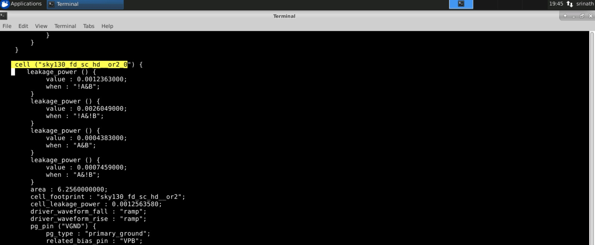

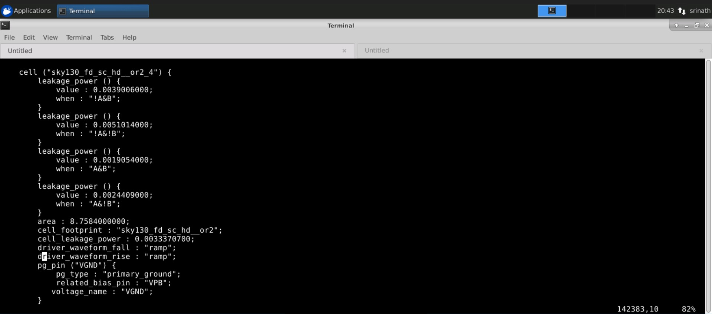

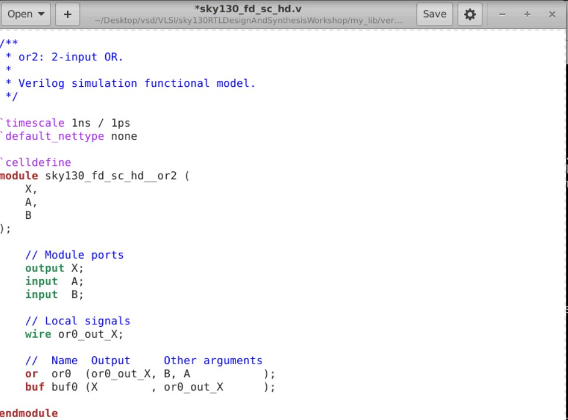

Based on the above images, it can be inferred that eventhough the behavioral logic of both the 2-input-OR gates or2_0 and or2_4 are same, they differ in their internal parameters like leakage power and area. The higher area of or2_4 infers that it employs wider transistors thereby confirming that it is a ```fast cell```.

### Part 2 - Hierarchical vs Flat Synthesis

Let us consider an example code ```multiple_modules``` which instantiates an ```AND``` & and ```OR``` gate logic in separate sub-modules ```sub_module1``` & ```sub_module2``` respectively. The verilog code for the same is displayed below:

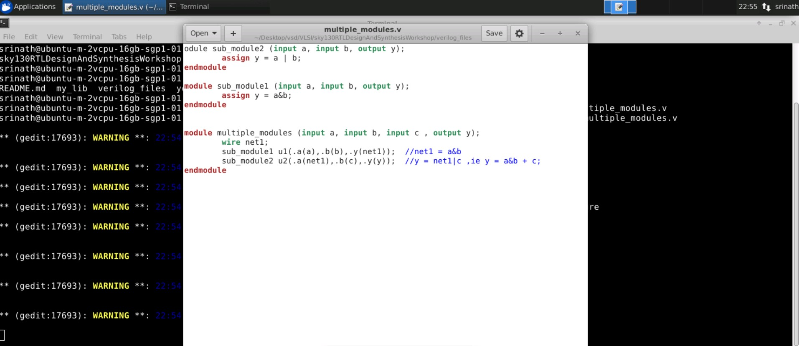

#### Hierarchical Synthesis

When we synthesize this verilog code using ```YOSYS``` with the following code blocks:

```
$yosys
yosys> read_liberty -lib ../my_lib/lib/sky130_fd_sc_hd__tt_025C_1v80.lib           

yosys> read_verilog multiple_modules.v                                                     

yosys> synth -top mutiple_modules                                                         

yosys> abc -lib ../my_lib/lib/sky130_fd_sc_hd__tt_025C_1v80.lib                    

yosys> show multiple_modules 
```

We get a netlist comprising of sub_module1 & sub_module2 instead of the logic gates AND & OR based netlist. This is because, the multiple_modules RTL design eventhough is implementing two logic gates based circuit, the gates are actually instances inside two separate sub_modules that are instantiated to obtain the specific logic. This type of sub_module level synthesis is known as **Hierarchical Synthesis** as the sub_modules are preserved in its hierarchy.

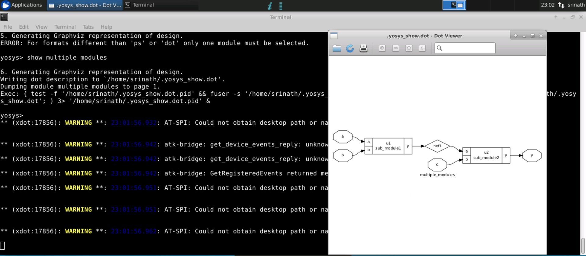

Now, we can write out the netlist of the hierarchical netlist file and look at the behavioral implementation of the same. 

```
write_verilog -noattr multiple_modules_hier.v
!gvim multiple_modules_hier.v
```


It can be seen that the OR gate is implemented using 2 ```INV``` and 1 ```NAND``` gate. This is because of a technical logic which is known as Stacked PMOS issue. Implementing a logic gate using Stacked PMOS concept results in poor mobility and is always avoided. That is why the OR gate was not implemented using 2 INV and 1 NOR gate logic as PMOS transistors are stacked in NOR gate implementation using transistors.

#### Flat Synthesis

Inorder to obtain a gate based synthesized netlist file without preserving any of the sub_module hierarchy, we implement the Flat Synthesis technique using the  flatten command. 

``` 
yosys> flatten
```

This command will implement the synthesis procedure without preserving the sub_module hierarchy and we obtain a netlist file of the multiple_modules RTL design implemented using the ```AND``` & ```OR``` gates

The flattened netlist and verilog module of the netlist file are obtained and listed as follows:

```
write_verilog -noattr multiple_modules_flat.v
!gvim multiple_modules_flat.v
```

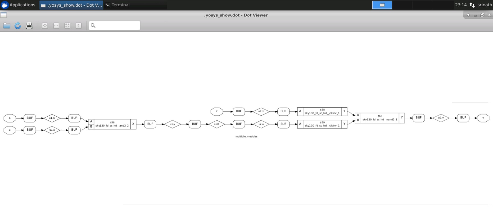

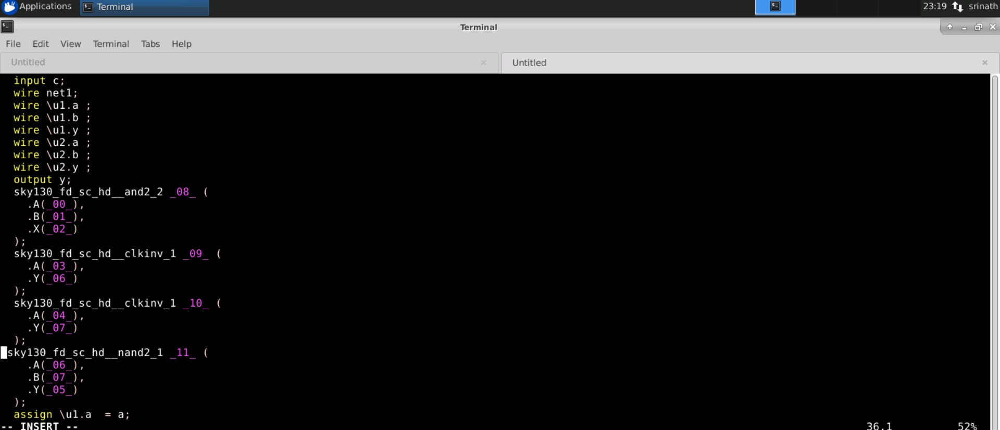

#### When do we need sub_module level Synthesis??

* Multiple Instances of the same module within the top level design :

When a design consists of multiple instances of the same module, we can use sub-module level synthesis and replicate the same for all the other instances of the same module and stitch it together to obtain the complete netlist file . This can be done by using one instance of the module in ```synth -top``` command.

* Massive Complex Design:

When there is a very large complex design consisting of several modules, running a complete synthesis will cause to tool like ```YOSYS``` to not provide expected results. In such a case the massive design can be split into small fragments in terms of sub-modules and synthesized separately to obtain simple netlist files and stitch back to get the netlist file of the complex design.

### Part 3 - Efficient Flip-flop coding styles and Optimizations

```Flipflops``` are devices which store a single bit (binary digit) of data in two states '1' or '0'. One common application of these flipflops is in large combinational circuits to avoid **glitch** errors due to propagation delays between logic gates which cause instability in output. The most common types of flip-flops are D-Flipflop, SR-Flipflop, JK Flipflop, T-Flipflop. There are various different methods of implementing these flipflops like synchronous reset and synchronous set or asynchronous reset and set etc. Listed below are different implementation / coding style of D-flipflop with async-reset or sync-reset or async set etc. 

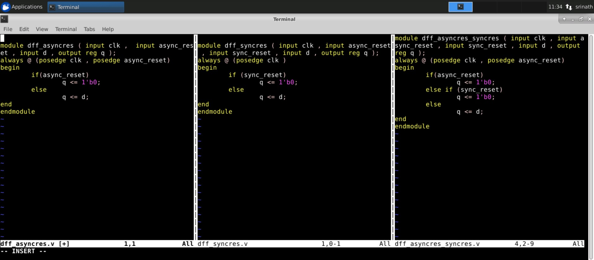

More information and examples of asynchronous and synchronous reset/set based flip-flop design can be found [here.](http://www.sunburst-design.com/papers/CummingsSNUG2003Boston_Resets.pdf). 

