# RTL Design  in Verilog using SKY130 Technology


## Table Of Contents 
  * ### [Project Scope](https://github.com/SrinathVelavan/SKY130-RTL-Design-Workshop/blob/main/README.md#project-scope)
  * ### [Getting Started](https://github.com/SrinathVelavan/SKY130-RTL-Design-Workshop/blob/main/README.md#getting-started)
  * ### [Introduction to Verilog RTL Design & Synthesis](https://github.com/SrinathVelavan/SKY130-RTL-Design-Workshop/blob/main/README.md#day-1----introduction-to-verilog-rtl-design-and-synthesis)
    * #### [Setting up libraries & lab instances](https://github.com/SrinathVelavan/SKY130-RTL-Design-Workshop/blob/main/README.md#part-1----setup-the-lab-instance-with-libraries-and-verilog-files)
    * #### [iverilog Simulation of 2:1 MUX RTL Design](https://github.com/SrinathVelavan/SKY130-RTL-Design-Workshop/blob/main/README.md#part-2---simulation-using-iverilog-simulator---21-multiplexer-rtl-design)
    * #### [Synthesis using YOSYS Tool](https://github.com/SrinathVelavan/SKY130-RTL-Design-Workshop/blob/main/README.md#part-3----synthesis-using-yosys-open-source-tool)
  * ### [Timing libs, Hierarchical vs Flat Synthesis & Efficient FlipFlop coding styles](https://github.com/SrinathVelavan/SKY130-RTL-Design-Workshop/blob/main/README.md#day-2---timing-libs-hierarchical-vs-flat-synthesis--efficient-flipflop-coding-styles)
    * #### [The .lib file](https://github.com/SrinathVelavan/SKY130-RTL-Design-Workshop/blob/main/README.md#part-1---more-about-the-lib-file)
    * #### [Hierarchical vs Flat Synthesis](https://github.com/SrinathVelavan/SKY130-RTL-Design-Workshop/blob/main/README.md#part-2---hierarchical-vs-flat-synthesis)
    * #### [Efficient Flipflop Coding Styles & Optimizations](https://github.com/SrinathVelavan/SKY130-RTL-Design-Workshop/blob/main/README.md#part-3---efficient-flip-flop-coding-styles-and-optimizations)
  * ### [Combinational & Sequentail Optimizations](https://github.com/SrinathVelavan/SKY130-RTL-Design-Workshop/blob/main/README.md#day-3---combinational-and-sequential-optimizations)
    * #### [Intro to Combinational Logic Optimizations](https://github.com/SrinathVelavan/SKY130-RTL-Design-Workshop/blob/main/README.md#part-1---intro-to-combinational-logic-optimizations)
    * #### [Intro to Sequential Logic Optimizations](https://github.com/SrinathVelavan/SKY130-RTL-Design-Workshop/blob/main/README.md#part-2---intro-to-sequential-logic-optimizations)
    * #### [Sequential Logic Optimizations of Un-used Outputs](https://github.com/SrinathVelavan/SKY130-RTL-Design-Workshop/blob/main/README.md#part-3---sequential-logic-optimizations-of-un-used-outputs)
  * ### [Gate Level Simulation (GLS), Blocking vs Non-blocking & Synthesis-Simulation Mismatch](https://github.com/SrinathVelavan/SKY130-RTL-Design-Workshop#day-4---gate-level-simulationgls-blocking-vs-non-blocking-and-synthesis-simulation-mismatch)
    * #### [Gate Level Simulation (GLS)](https://github.com/SrinathVelavan/SKY130-RTL-Design-Workshop#part-1---what-is-gate-level-simulation-gls-)
    * #### [Synthesis - Simulation Mismatches](https://github.com/SrinathVelavan/SKY130-RTL-Design-Workshop#part-2---synthesis---simulation-mismatches)
    * #### [Blocking vs Non-blocking Assignments](https://github.com/SrinathVelavan/SKY130-RTL-Design-Workshop#blocking-vs-non-blocking-assignments)
  * ### [IF..CASE Statments & For Loop..For generate]
 
  
  


## Project Scope

The project provides a detailed account of the 5-day workshop facilitated by VSD on RTL Design in Verilog using the SKY130 Technology. 

SKY130 is the hardware industry's first open-source process design kit (PDK) released by SkyWater Technology Foundry in collaboration with Google giving all hardware design experts and aficionados, a worldwide access to their IP functions and open source ASICs. More details [here.](https://github.com/google/skywater-pdk)

This particular workshop covers the various aspects of design in Verilog HDL both theoretically and practically with labs using open-source softwares through their VSD-IAT portal. Beginning with an introduction to digital design using Verilog HDL, the instructors cover digital design steps that include design, functional simulation, test bench based validation of the design functionality and logic Synthesis with optimization. Further, we learn about efficient verilog coding styles that result in a predictable logic in Silicon. 


## Getting Started

Users interested in practicing design using open-source tools need a Linux based OS and a host of open source EDA tools. More information regarding the installation and scripts can be found in the free UDemy tutorial [here.](https://www.udemy.com/course/vsd-a-complete-guide-to-install-open-source-eda-tools/?src=sac&kw=VSD+-+A+complete+guide+to)

Basic knowledge of Verilog HDL is required to follow the content without any difficulties

---
## Day 1 -  Introduction to Verilog RTL Design and Synthesis

The first day covers the basics of RTL Design, Testbench, Simulation and Synthesis. Open-Source softwares like iverilog (simulator) and YOSYS (Synthesis) are provided through remote access in the portal to practice labs.

RTL Design -  It consists of an actual verilog code / a set of verilog codes that have the functionality to meet the required design specifications of the circuit
TestBench - Testbench is a setup that one uses to apply a set of stimuli (test-case vector) to check the functional working of the design file

We do the above processes using a simulator software. The simulator is loaded with the design and its respective testbench file after which it looks for changes in the input signals and depending on the change, the output is evaluated. These changes in input and corresponding output values are dumped in a special format file called "value change dump" (.vcd) file. This file can be pictorially represented in waveforms using a waveform tool like gtkwave. 

### Part 1 -  Setup the lab instance with libraries and verilog files

Firstly, we have to clone 2 separate repositories namely [vsdflow](https://github.com/kunalg123/vsdflow) and [sky130RTLDesignAndSynthesisWorkshop](https://github.com/kunalg123/sky130RTLDesignAndSynthesisWorkshop) which contain the required library files and verilog design files to perform the simulations and logic synthesis parts of the workshop. It can be done using basic linux command gitclone ex: git clone https://github.com/kunalg123/vsdflow.git .
We are given a default set of files and libraries shown below to work on using the practical lab instance


### Part 2 - Simulation using iverilog simulator - 2:1 multiplexer rtl design

After cloning the respective repositories in our lab instance, we perform a simulation run of 2:1 multiplexer rtl file namely good_mux.v and its corresponding testbench file tb_good_mux.v to obtain .vcd files and analyze the waveform in gtkwave to see the change in output instances with respect to change in input values. 

#### Verilog file of a simple 2:1 multiplexer


#### Verilog testbench file of the corresponding 2:1 multiplexer with stimuli


#### Simulation results using iverilog simulator


#### Waveform using gtkwave


### Part 3 -  Synthesis using YOSYS open-source tool

After simulation of the rtl design with the respective testbench, we perform a synthesis of the design using Synthesizer. A Synthesizer is a tool used to convert the RTL Design into a netlist file (Standard Cell Format). To be more specific, a **netlist** is a standard gate level file that consists of nets, sequential and combinational cells and their connectivity of the corresponding RTL file coded using a HDL. In simple words, an rtl file is a code that describes the functionality of the design and a netlist is a file that expresses the same code in the form of logic cells like logic gates, flipflops, multiplexers with net connections etc. 

Here, we use a synthesizer tool called [YOSYS](https://github.com/YosysHQ/yosys) which is a part of Qflow (open-source) tool chain for complete RTL2GDS transformation. The basic input files to YOSYS include the RTL Design file and .lib (library) files. 

**What is a .lib file?**

--> .lib files are a collection of logical modules which include logic gates like AND, OR, NOT, NAND, NOR etc. Each logic gate is stored in one or more flavours depending on the number of inputs and speed of the circuit (slow, fast & medium). 

Why do we need different flavours of the same logic gate?

--> Combinational delays present in a logic path determine the maximum speed and performance of a logic circuit. For Example, to get a maximum performance from a circuit, we need to design the circuit with minimum clock delays. 

Inorder to obtain minimum clock delays, we require very fast cells to minimize the clock delays. 

In the same way, inorder to avoid Hold violations in a logic path, we have to use SLOW cells to synchronize the hold time for logic path. 

All these different types of fast and slow cells are present in a .lib file to be used by the synthesis software tool

#### Faster Cells vs Slower Cells

A cell delay in the digital logic circuit depends on the load of the circuit which here is Capacitance. 

Faster the charging / discharging of the capacitance --> Lesser is the Cell Delay

Inorder to charge/discharge the capacitance faster, we use wider transistors that can source more current. This will help us reduce the cell delay but at the same time, wider transistors consumer more power and area. Similarly, using narrower transistors help in reduced area and power but the circuit will have a higher cell delay. Hence, we have to compromise on area and power if we are to design a circuit with low cell delay.

#### Constraints 

A Constraint is a guidance file given to a synthesizer inorder to enable an optimum implementation of the logic circuit by selecting the appropriate flavour of cells (fast or slow). 

#### Practical Synthesis using YOSYS

We perform a synthesis of the 2:1 Multiplexer RTL design using YOSYS with appropriate library files from SKY130 technology that we cloned into the directory. 

Coding scripts for Synthesis using YOSYS

```
$yosys                                                                             --> invokes YOSYS tool

yosys> read_liberty -lib ../my_lib/lib/sky130_fd_sc_hd__tt_025C_1v80.lib           --> reads the corresponding library file

yosys> read_verilog good_mux.v                                                     --> reads the Verilog script

yosys> synth -top good_mux                                                         --> reads the top level module

yosys> abc -liberty ../my_lib/lib/sky130_fd_sc_hd__tt_025C_1v80.lib                    --> converts the logic file to netlist

yosys> show                                                                        --> Final netlist output display
```

#### Screenshots of the Sysnthesis procedure using YOSYS


The final sysnthesized netlist shows that the 2:1 multiplexer RTL is translated to a gate level representation using buffers, 2 input NAND gate , and OR gate and an o21ai_0 (OR,AND  & NOT gate) 

----

## Day 2 - Timing libs, Hierarchical vs Flat Synthesis & Efficient FlipFlop coding styles

### Part 1 - More about the .lib file

We have seen that a .lib file is a collection of different flavours of standard cells with nets. In this workshop, we use the **sky130_fd_sc_hd_tt_025C_1v80.lib**. Looking in depth into the naming of this lib file, it denotes the following:

fd --> Foundry

sd --> Standard Cell

hd --> High Density

tt --> Typical Process

025C --> Temperature 

1v80 --> Voltage 

Here, the tt_025C_1v80 denote the PVT (Process,Voltage & Temperature corners) of the library design. 

Upon opening the .lib file for reference using 

```gvim ../my_lib/lib/sky130_fd_sc_hd_tt_025C_1v80.lib```

We get to see detailed parameter values of all the different flavours of standard cells (logic gates etc.). The parameters include the leakage power of each input value of the cell, area of the cell, cell footprint, cell leakage power, driver waveform etc. These parameters vary for each flavour of the same cell with the same functionality. 

For Example: A 2 input or gate has different flavours like or2_0, or2_1, or2_2 and so on. Each cell has different values of leakage power, area etc. This is shown below:


Based on the above images, it can be inferred that eventhough the behavioral logic of both the 2-input-OR gates or2_0 and or2_4 are same, they differ in their internal parameters like leakage power and area. The higher area of or2_4 infers that it employs wider transistors thereby confirming that it is a ```fast cell```.

### Part 2 - Hierarchical vs Flat Synthesis

Let us consider an example code ```multiple_modules``` which instantiates an ```AND``` & and ```OR``` gate logic in separate sub-modules ```sub_module1``` & ```sub_module2``` respectively. The verilog code for the same is displayed below:


#### Hierarchical Synthesis

When we synthesize this verilog code using ```YOSYS``` with the following code blocks:

```
$yosys
yosys> read_liberty -lib ../my_lib/lib/sky130_fd_sc_hd__tt_025C_1v80.lib           

yosys> read_verilog multiple_modules.v                                                     

yosys> synth -top mutiple_modules                                                         

yosys> abc -liberty ../my_lib/lib/sky130_fd_sc_hd__tt_025C_1v80.lib                    

yosys> show multiple_modules 
```

We get a netlist comprising of sub_module1 & sub_module2 instead of the logic gates AND & OR based netlist. This is because, the multiple_modules RTL design eventhough is implementing two logic gates based circuit, the gates are actually instances inside two separate sub_modules that are instantiated to obtain the specific logic. This type of sub_module level synthesis is known as **Hierarchical Synthesis** as the sub_modules are preserved in its hierarchy.


Now, we can write out the netlist of the hierarchical netlist file and look at the behavioral implementation of the same. 

```
write_verilog -noattr multiple_modules_hier.v
!gvim multiple_modules_hier.v
```


It can be seen that the OR gate is implemented using 2 ```INV``` and 1 ```NAND``` gate. This is because of a technical logic which is known as Stacked PMOS issue. Implementing a logic gate using Stacked PMOS concept results in poor mobility and is always avoided. That is why the OR gate was not implemented using 2 INV and 1 NOR gate logic as PMOS transistors are stacked in NOR gate implementation using transistors.

#### Flat Synthesis

Inorder to obtain a gate based synthesized netlist file without preserving any of the sub_module hierarchy, we implement the Flat Synthesis technique using the  flatten command. 

``` 
yosys> flatten
```

This command will implement the synthesis procedure without preserving the sub_module hierarchy and we obtain a netlist file of the multiple_modules RTL design implemented using the ```AND``` & ```OR``` gates

The flattened netlist and verilog module of the netlist file are obtained and listed as follows:

```
write_verilog -noattr multiple_modules_flat.v
!gvim multiple_modules_flat.v
```


#### When do we need sub_module level Synthesis??

* Multiple Instances of the same module within the top level design :

When a design consists of multiple instances of the same module, we can use sub-module level synthesis and replicate the same for all the other instances of the same module and stitch it together to obtain the complete netlist file . This can be done by using one instance of the module in ```synth -top``` command.

* Massive Complex Design:

When there is a very large complex design consisting of several modules, running a complete synthesis will cause to tool like ```YOSYS``` to not provide expected results. In such a case the massive design can be split into small fragments in terms of sub-modules and synthesized separately to obtain simple netlist files and stitch back to get the netlist file of the complex design.

### Part 3 - Efficient Flip-flop coding styles and Optimizations

```Flipflops``` are devices which store a single bit (binary digit) of data in two states '1' or '0'. One common application of these flipflops is in large combinational circuits to avoid **glitch** errors due to propagation delays between logic gates which cause instability in output. The most common types of flip-flops are D-Flipflop, SR-Flipflop, JK Flipflop, T-Flipflop. There are various different methods of implementing these flipflops like synchronous reset and synchronous set or asynchronous reset and set etc. Listed below are different implementation / coding style of D-flipflop with async-reset or sync-reset or async set etc. 


More information and examples of asynchronous and synchronous reset/set based flip-flop design can be found [here](http://www.sunburst-design.com/papers/CummingsSNUG2003Boston_Resets.pdf). 

Inorder to simulate the RTL designs, we use the ```iverilog``` simulator to obtain simulated .vcd files that can be viewed using ```gtkwave``` analyzer. 

Example Snippet:

```
iverilog dff_asyncres.v tb_asyncres.v
./a.out
gtkwave tb_dff_asyncres.vcd
```

The simulation results of 3 D-Flipflops with async-reset , sync-reset & async-reset sync-reset are as follows:

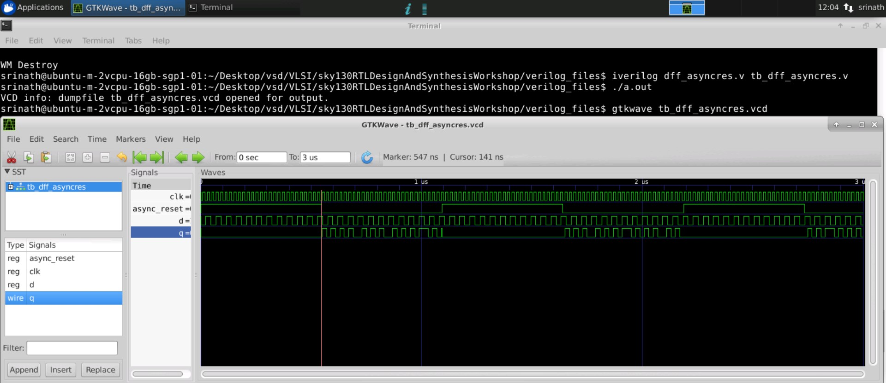

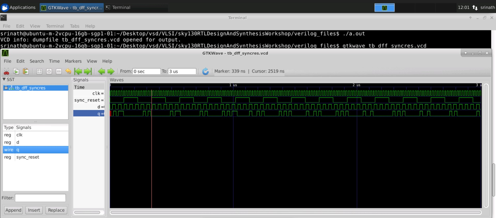

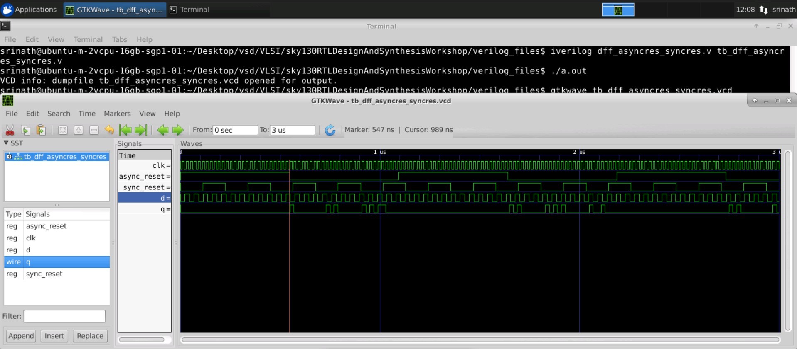

Further, the design files can be synthesized in YOSYS as we have done in the previous sessions. The one new command we use here is the ```dfflibmap``` command, that is used when we deploy D-FlipFlops in the RTL design. The **dfflibmap** command links or maps the library files that contain the details of D-Flipflops to be used for synthesis. The coding snippet for synthesizing a D-Flipflop in YOSYS is given below:

``` 
$yosys

yosys> read_liberty -lib ../my_lib/lib/sky130_fd_sc_hd__tt_025C_1v80.lib           

yosys> read_verilog dff_asyncres.v                                                     

yosys> synth -top dff_asyncres                                                         

yosys> dfflibmap -liberty ../my_lib/lib/sky130_fd_sc_hd__tt_025C_1v80.lib

yosys> abc -liberty ../my_lib/lib/sky130_fd_sc_hd__tt_025C_1v80.lib                    

yosys> show 
```

The Synthesized netlist of a Asynchronous Reset based D-Flipflop is displayed as follows. 

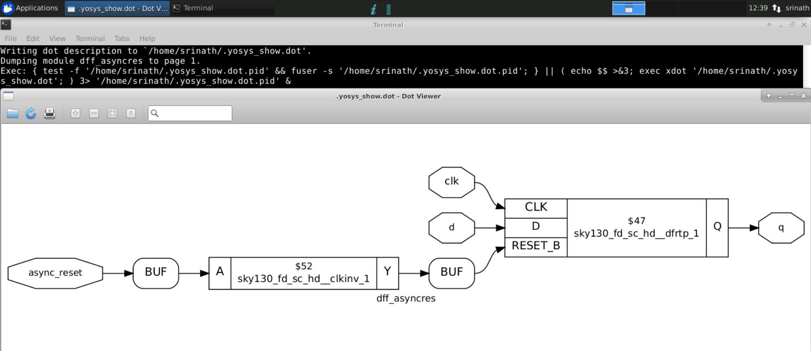

In the above netlist, it can be seen that the asynchronous reset D-Flipflop is implemented as a D-Flipflop with Active Low reset. This Active low reset is fed with an inverter to convert it into an Active High reset as an input to reset port of the flop. Similarly, using the above snippet, synthesis can be done for other D-Flipflop models in the verilog_models folder and netlist can be obtained for your study.

----

## Day 3 - Combinational and Sequential Optimizations

### Part 1 - Intro to Combinational Logic Optimizations

**Why do we need Combinational Logic Optimizations?**

* Primarily to squeeze the logic to get the most optimized design
  * An optimized design results in comprehensive Area and Power saving

**Types of Combinational Optimizations**

 * Constant Propagation
    * Direct Optimization Technique
 * Boolean Logic Optimization
    * K-Map based 
    * Quine Mckluskey Algorithms

**CONSTANT PROPAGATION**

In Constant propagation techniques, inputs that are no way related or affecting the changes in the output are ignored/optimized to simplify the combination logic thereby saving area and power usage by those input pins. 

**BOOLEAN LOGIC OPTIMIZATION**

Boolean logic optimization is nothing simplifying a complex boolean expression into a simplified expression by utilizing the laws of boolean logic algebra. 

``` 
assign y = a?(b?c:(c?a:0)):(!c)
```

The above equation can be very much simplified into 

```
y = a'c' + a(bc + b'ca) 
y = a'c' + abc + ab'c 
y = a'c' + ac(b+b') 
y = a'c' + ac
y = a xor c
```

Thus, the complex ternary operator based equation is simplified into a simple xor gate with two inputs a and c

The following pictures depict the various versions of combination logic expressions simplified using Combinational logic optimization techniques.

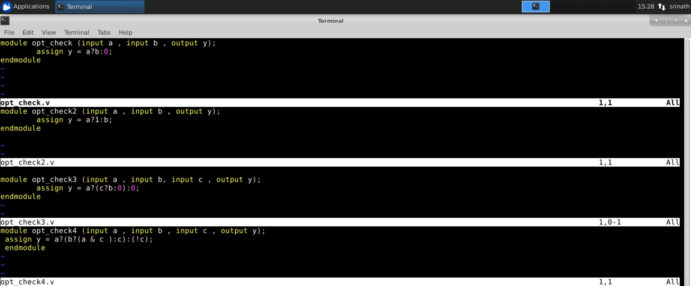

```
$yosys

yosys> read_liberty -lib ../my_lib/lib/sky130_fd_sc_hd__tt_025C_1v80.lib           

yosys> read_verilog opt_check.v                                                     

yosys> synth -top opt_check                                                         

yosys> opt_clean -purge

yosys> abc -liberty ../my_lib/lib/sky130_fd_sc_hd__tt_025C_1v80.lib                    

yosys> show 
```

In the above snippet, we see a new code ```opt_clean -purge``` which is used to optimize the design by removing un-used net and components in the design after the design top level is synthesized using ```synt -top```

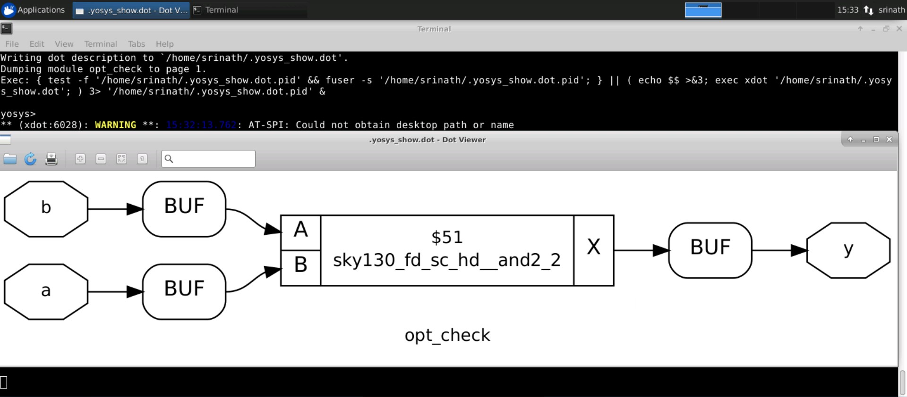

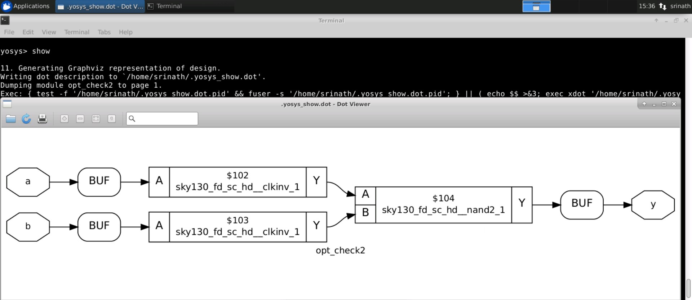

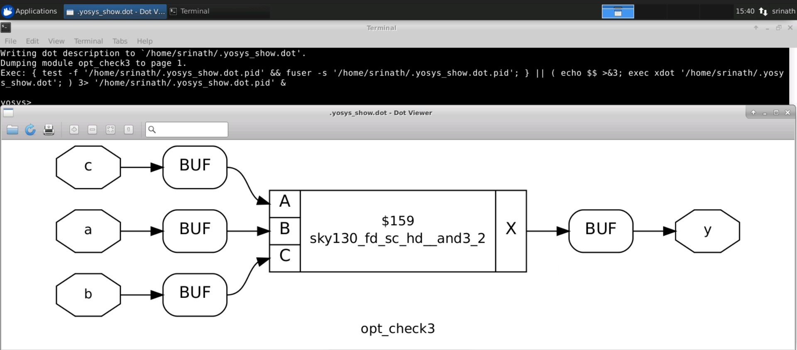

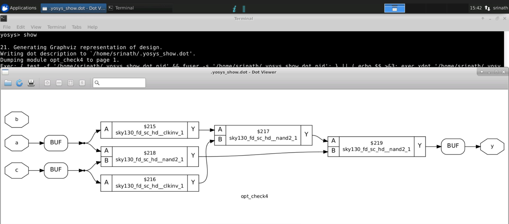

The above images depict various optimizations done on the expressions being simplified by boolean logic optimization.

Similarly, incase we use multiple modules in a single code, we use ```flatten``` command as used in Flat Sysnthesis to perform the logic optimization of multiple modules after they are reduced to simple modules using flatten. 

Some examples implemented are listed below:

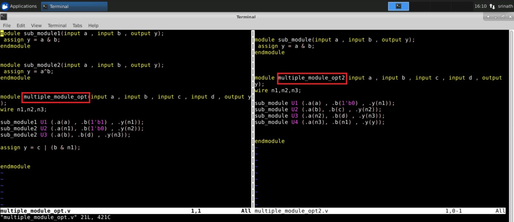


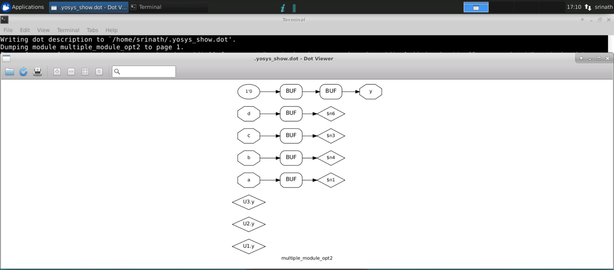

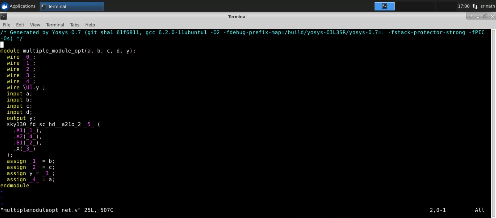

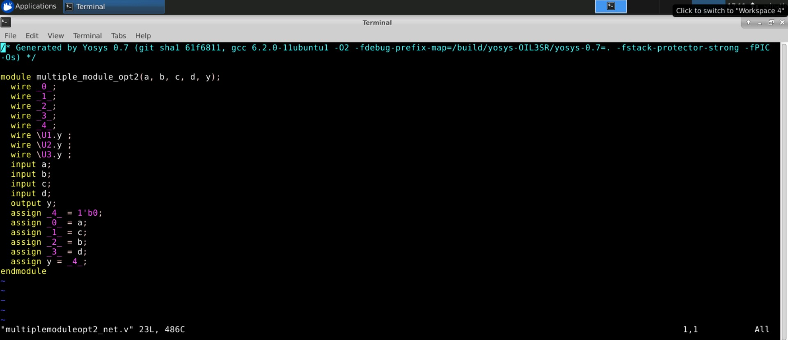

### Part 2 - Intro to Sequential Logic Optimizations

For Sequential Logic optimization, let us the consider the codes below. They are different implementations of D-Flipflop dff with different cases of output assumptions based on the set and reset values. 

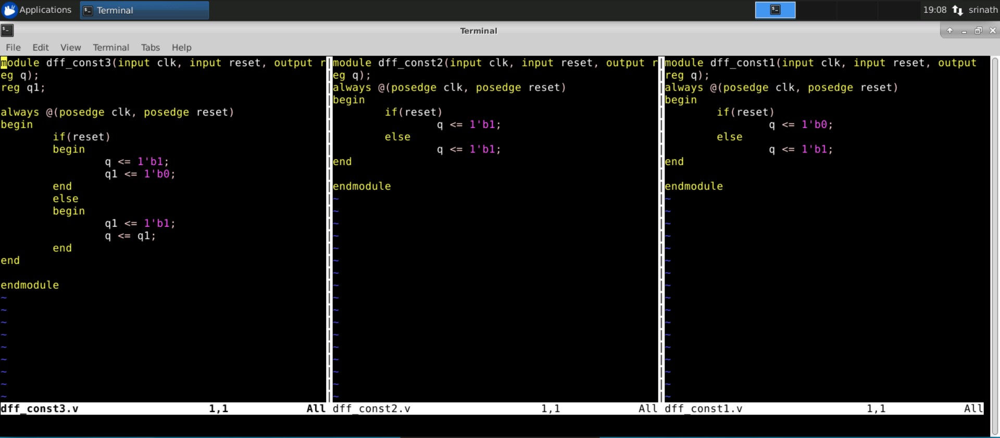

Now when we try to simulate the verilog codes of dff_const1 & dff_const2 which are similar except for the output if reset is high, we can see different circuits that are created as a result of optimization of sequential logic. 

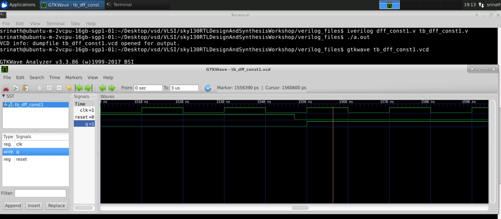

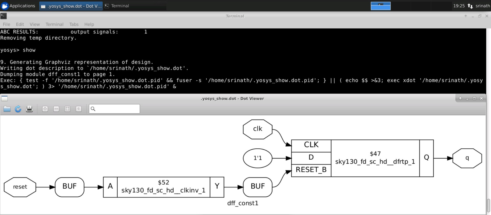

Incase of dff_const1, the output q doesn't immediately become high when reset is low. It waits for the next clock edge to assert back to high. Hence, here the final net will consist of a D-Flipflop with an active low reset. Since, we have coded the RTL to be of active high reset, the input to D-FF is an active high reset through an inverter. 

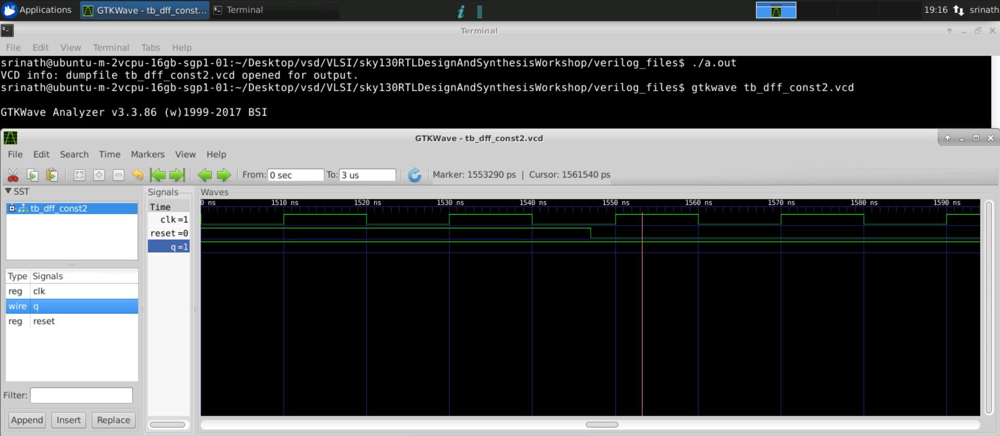

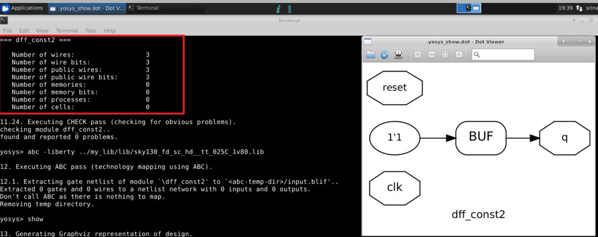

Incase dff_const2, the output of the logic is q = 1'b1 regardless of the condition of reset (high/low). Hence, the circuit is optimized to just contain the value of q = 1'b1 through a buffer. Here, a D-Flipflop is not synthesized as it is not needed for the logic function of the circuit.

Now, let us see the optimization we obtain for the implementation of dff_const3. 

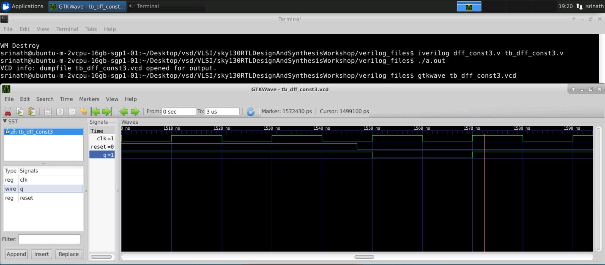

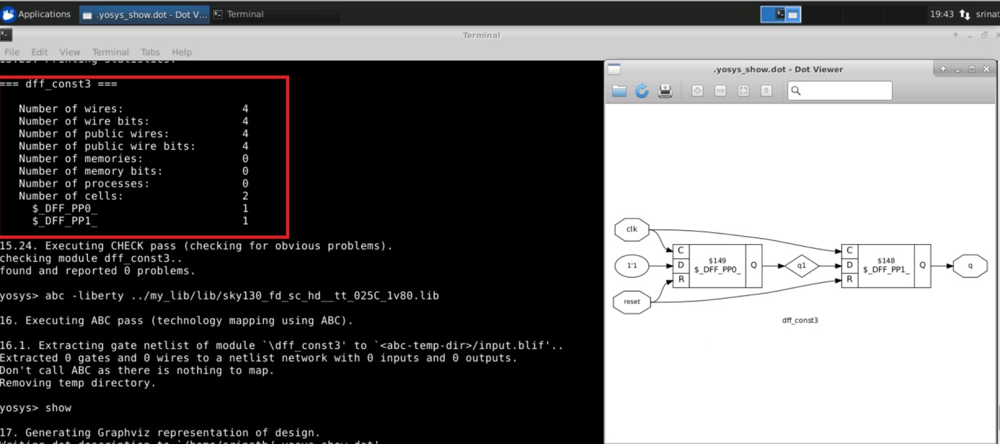

Similarly, you can implement the logic of dff_const4 and dff_const5 and synthesize the logic and compare the net and waveforms. 

### Part 3 - Sequential Logic Optimizations of Un-used Outputs

In this special case of sequential optmization, we look at an example of a 3-bit counter code given below.

```
module counter_opt ( input clk, input reset, output q);
reg [2:0] count;
assign q = count[0];

always @(posedge clk, posedge reset)
begin
     if(reset)
             count <= 3'b000;
     else
             count <= count + 1;
end
endmodule
```

The above code is a 3-bit counter that increments from 0 to 7 whenever reset is low. But, we can see that the final output q denotes only the LSB of count that is count[0]. Therefore, the values of output count[2] and count[1] are un-used and in no way affect our output and logic. Thus, when we synthesize we obtain a circuit that only implements output count[0] and forms a toggle to the input of the D-Flipflip d-input. 


---

## Day 4 - Gate Level Simulation(GLS), Blocking vs Non-blocking and Synthesis-Simulation Mismatch

### Part 1 - What is Gate Level Simulation (GLS) ?

Running the testbench against the synthesized netlist ouput as a DUT is known as Gate Level Simulation (GLS). The Output netlist should logically be same as the RTL code so that the testbench will align itself when we simulate both the files to obtain the waveforms.

#### Why GLS?

GLS is required to verify the logical correctness of the design post synthesis with the help of the netlist file. It ensures whether the timing of the design is met and for thi, the GLS used to run with delay annotations.

#### How to perform GLS after obtaining a netlist output for a specific RTL design?

To perform GLS using iverilog simulator, we need to add the path of the primitives and sky130 library files along with the netlist verilog code and testbench to successfully obtain the waveforms of post synthesis simulation.

```
$ iverilog ../my_lib/verilog_model/primitives.v ../my_lib/verilog_model/sky130_fd_sc_hd.v ***netlist_file.v*** ***testbench_file.v***
```

An example of GLS vs Simulation output is given below for a ternary operator mux RTL code.

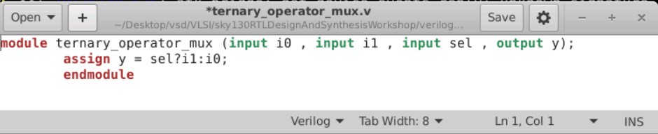

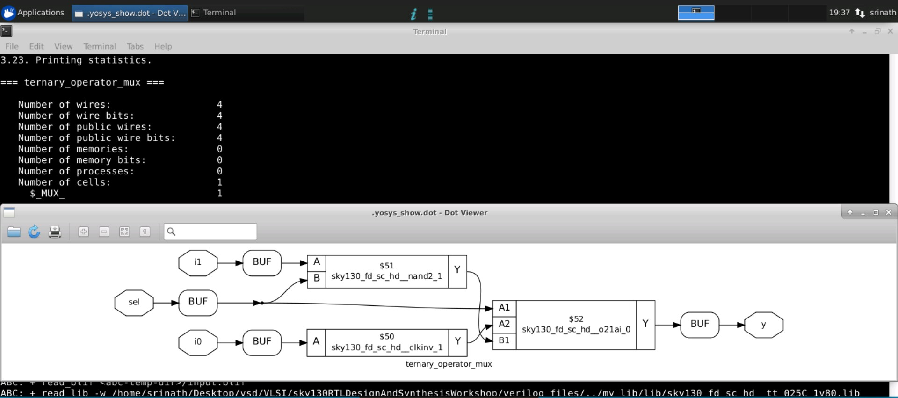

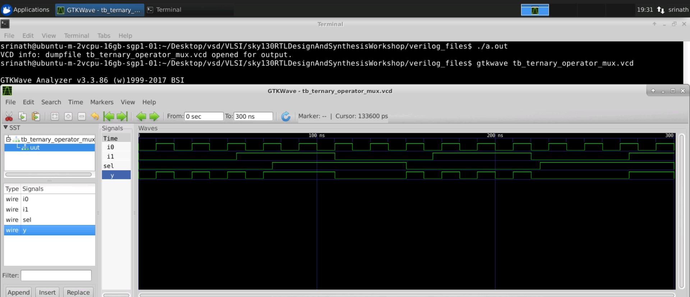

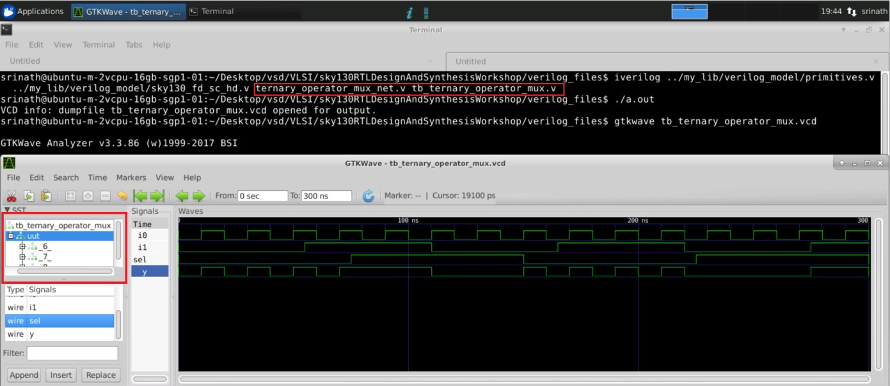

The above waveforms represent the Simulation results and GLS results of the ternary_operator_mux.v RTL code. It is obeserved that both the waveforms are same and hence state that GLS of netlist and Simulation of RTL match for all cases.

### Part 2 - Synthesis - Simulation Mismatches

Certain issues rise up when the simulation results of the RTL code do not match with that of the GLS of the synthesized netlist file. Such issues are known as Synthesis-Simulation mismatch. 

#### Major causes of Synthesis-Simulation Mismatches are:
     
* Missing sensitivity lists
* Blocking vs Non-blocking assignments
* Non-standard verilog coding techniques

#### Missing Sensitivity List

A Simulator works based on an 'activity' --> change in outputs due to change in corresponding inputs. This change can occur to conditions or variables specified in the sensitivity lists. Whereas, a Synthesizer works by only looking at behavioural logic changes and not based on the signal changes in the sensitivity list.

For Example: in an always block, the operation happens only when there is a change in signals listed inside the always block (sensitivity list). Therefore, it is conventional to mention all such signals with the always block. If one or two of the signals are not added to the sensitivity list, then the block may not run for changes in those respective signal changes. This can alter the simulation results and waveforms. But, since **Synthesizer** does not look at the sensitivity list, it executes the logic and provides a different set of waveform outputs during GLS.

Such abnormalities in the simulation output waveforms case a Synthesize-Simulation mismatch due to missing sensitivity list.

As an example Synth-Simulation mismatch due to missing sensitivity list is given below. The RTL is that of a bad implementation of a mux where the output changes in y are not reflected when the sel signal is 0. This is due to improper sensitivity list.

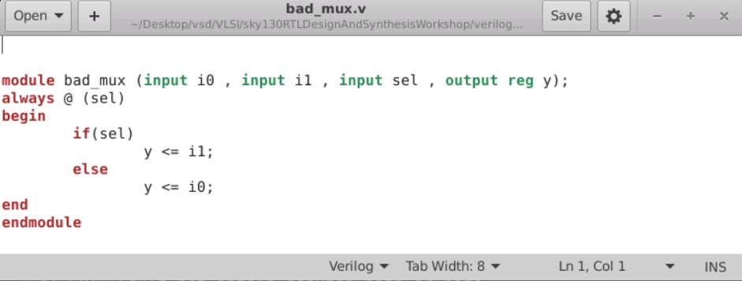

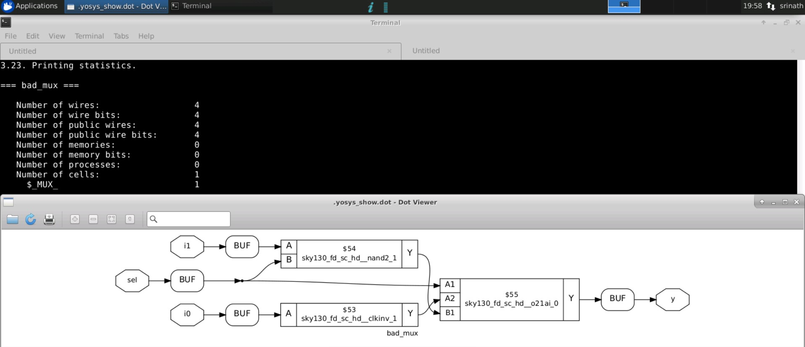

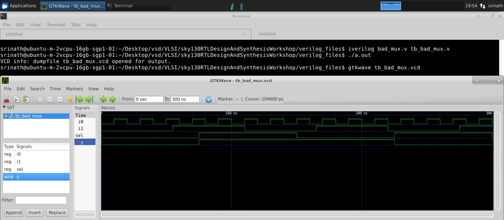

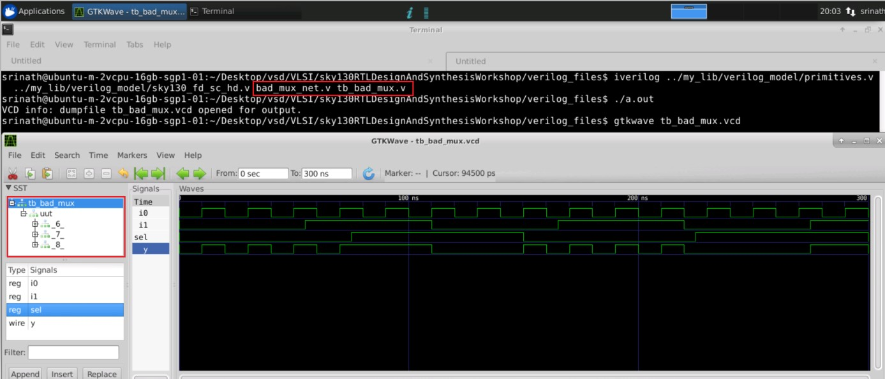

We can clearly see that the simulation of RTL code with testbench shows abnormalities as it follows activity changes where the sensitivity list is incomplete. Whereas, the synthesizer does not work based on the sensitivity list and hence the output of GLS is as per the logic intended. This is known as Synthesis-Simulation Mismatch
     
#### Blocking vs Non-blocking Assignments

Blocking and Non-blocking statements are procedural assignment statements that can be implemented only inside an **always** block. 

* Blocking Assignments --> **=** 
    * Executes the statements in the order in which they are coded.
* Non-blocking Assignments --> **<=** 
    * Executes the RHS of all such assignments when the always block is entered and assigned to LHS in a parallel evaluation.

Synthesis-Simulation mismatches due to incorrect ordering of the blocking assignments done inside an always block. 

Let us consider an example code and its outputs below listed below.

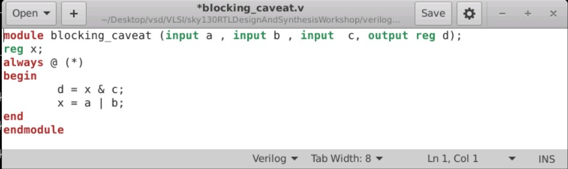

In the above mentioned code, the ordering of blocking assignments is wrong as the assignment of ``` d = x & c ``` is done before ``` x = a | b ```. The value of x in evaluation of d is missing as it happens only the consecutive statement. Hence, while performing a simulation, the output latches on to the past value of x resulting in a flop.

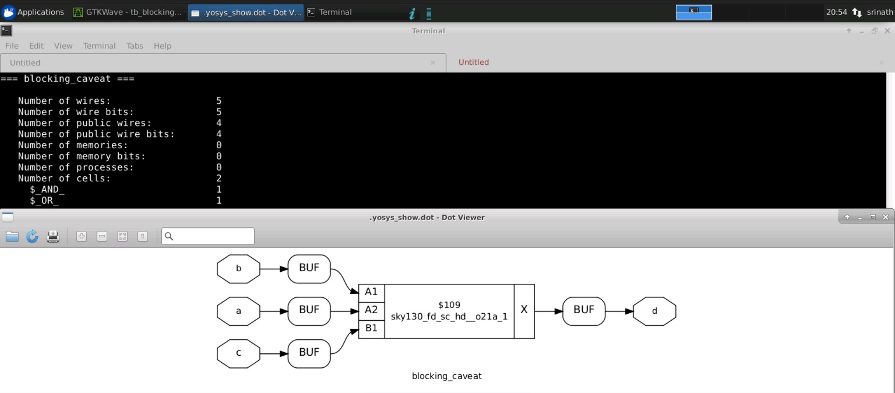

The resulting synthesis netlist shows that it does not consider the mismatch due to incorrect ordering of the blocking statement. It follows the logic and implements a o21a_1 gate wih a,b,c as inputs. 

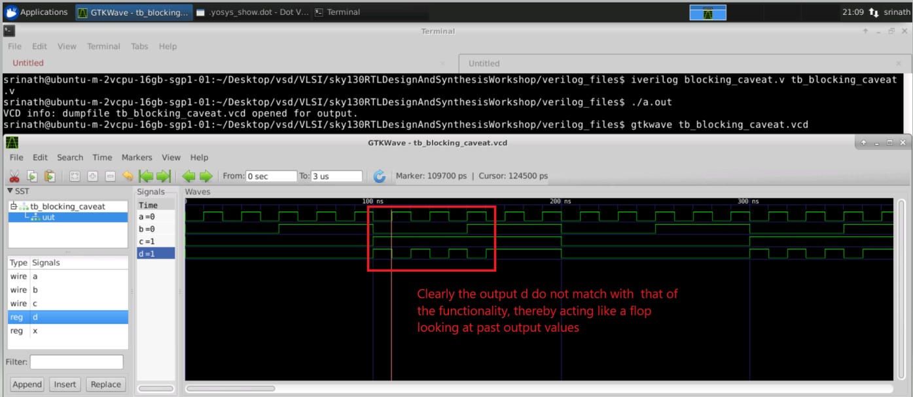

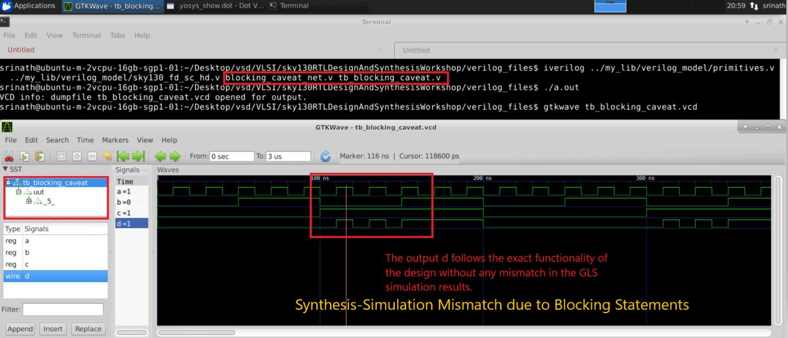

The Synthesis-Simulation mismatch is evident from the descriptions in the waveforms of simulations and GLS. 

Therefore, ``` Always use blocking assignments for Combinational Logic & Non-blocking assignments for Sequential Logic```

----

## Day 5 - If.. Case Statements and for loop & for generate statements

### Part 1 - If.. Statements

**if** statements are used to write priority logic. It can infer a multiplexer HW is written properly. The top most / beginning if condition has the **highest priority**. If not written properly including all conditions and outputs, they can result in **INFERRED LATCHES**. 

#### INFERRED LATCHES due to improper if constructs

Consider the example of the code using if.. statement given below

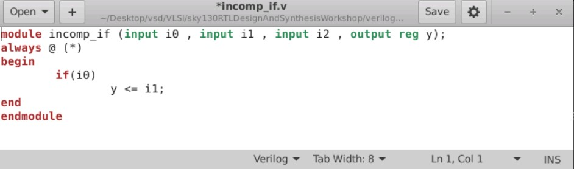

It is evident that the if.. conditions are not properly met. When i0 is 1, output y = i1, and the else condition of what happens when i0 is not 1 is left out without any mention. Hence, during synthesis, the yosys will consider retaining the previous value for y when i0 is not 1. This is the cause for inferred D-Latch that we see in the output netlist below.

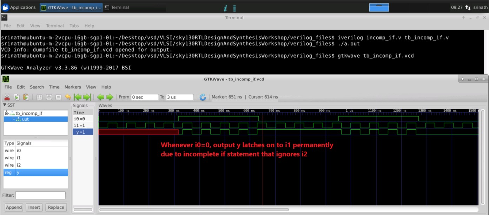

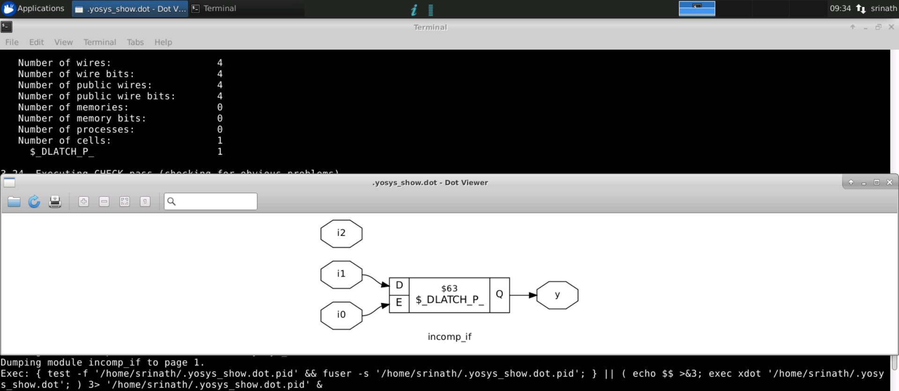

Let us consider another example of incomplete if.. statements where else..if conditions are specified but the final else condition is omitted which also results in an inferred latch as specified in the output waveforms and netlists.

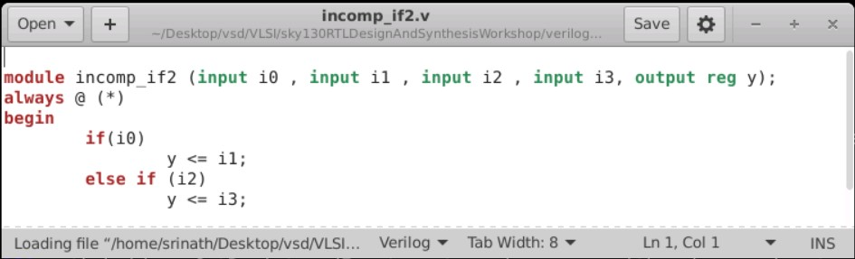

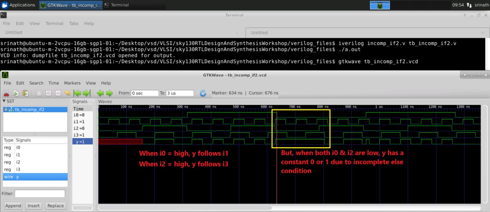

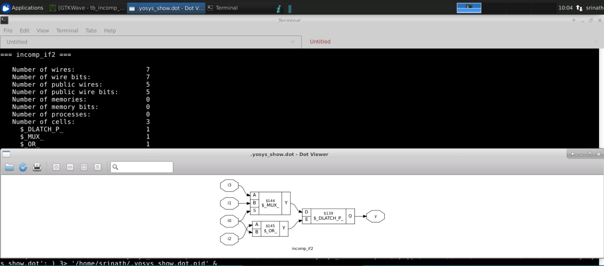


