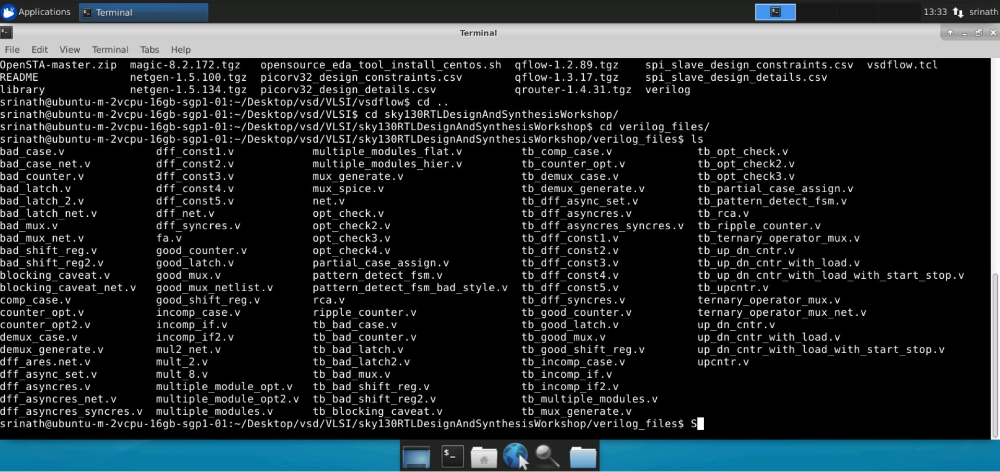
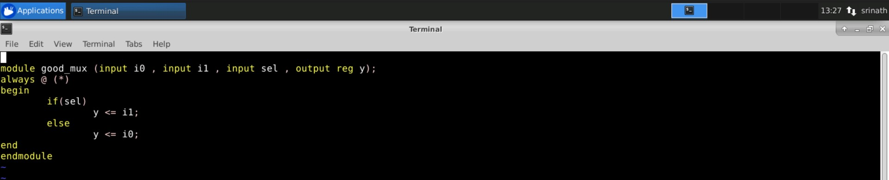
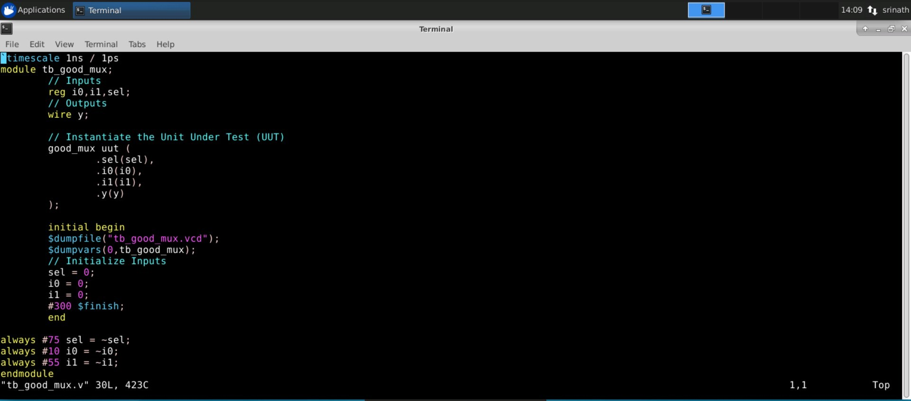
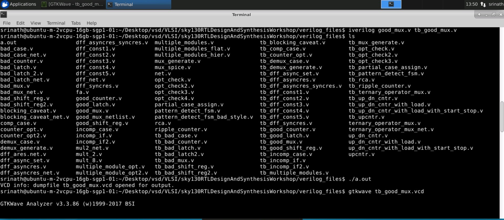
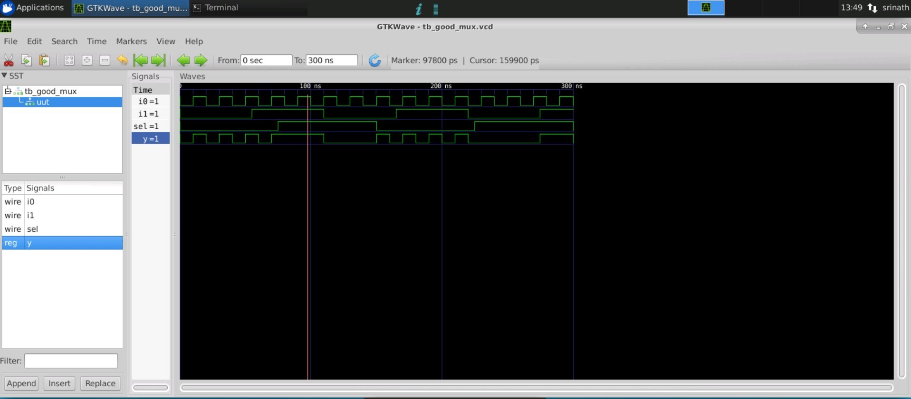

# RTL Design  in Verilog using SKY130 Technology

## Project Scope

The project provides a detailed account of the 5-day workshop facilitated by VSD on RTL Design in Verilog using the SKY130 Technology. 

SKY130 is the hardware industry's first open-source process design kit (PDK) released by SkyWater Technology Foundry in collaboration with Google giving all hardware design experts and aficionados, a worldwide access to their IP functions and open source ASICs. More details [here.](https://github.com/google/skywater-pdk)

This particular workshop covers the various aspects of design in Verilog HDL both theoretically and practically with labs using open-source softwares through their VSD-IAT portal. Beginning with an introduction to digital design using Verilog HDL, the instructors cover digital design steps that include design, functional simulation, test bench based validation of the design functionality and logic Synthesis with optimization. Further, we learn about efficient verilog coding styles that result in a predictable logic in Silicon. 

## Getting Started

Users interested in practicing design using open-source tools need a Linux based OS and a host of open source EDA tools. More information regarding the installation and scripts can be found in the free UDemy tutorial [here.](https://www.udemy.com/course/vsd-a-complete-guide-to-install-open-source-eda-tools/?src=sac&kw=VSD+-+A+complete+guide+to)

Basic knowledge of Verilog HDL is required to follow the content without any difficulties

---
## Day 1 -  Introduction to Verilog RTL Design and Synthesis

The first day covers the basics of RTL Design, Testbench, Simulation and Synthesis. Open-Source softwares like iverilog (simulator) and YOSYS (Synthesis) are provided through remote access in the portal to practice labs.

RTL Design -  It consists of an actual verilog code / a set of verilog codes that have the functionality to meet the required design specifications of the circuit
TestBench - Testbench is a setup that one uses to apply a set of stimuli (test-case vector) to check the functional working of the design file

We do the above processes using a simulator software. The simulator is loaded with the design and its respective testbench file after which it looks for changes in the input signals and depending on the change, the output is evaluated. These changes in input and corresponding output values are dumped in a special format file called "value change dump" (.vcd) file. This file can be pictorially represented in waveforms using a waveform tool like gtkwave. 

### Part 1 -  Setup the lab instance with libraries and verilog files

Firstly, we have to clone 2 separate repositories namely [vsdflow](https://github.com/kunalg123/vsdflow) and [sky130RTLDesignAndSynthesisWorkshop](https://github.com/kunalg123/sky130RTLDesignAndSynthesisWorkshop) which contain the required library files and verilog design files to perform the simulations and logic synthesis parts of the workshop. It can be done using basic linux command gitclone ex: git clone https://github.com/kunalg123/vsdflow.git .
We are given a default set of files and libraries shown below to work on using the practical lab instance

### Part 2 - Simulation using iverilog simulator - 2:1 multiplexer rtl design

After cloning the respective repositories in our lab instance, we perform a simulation run of 2:1 multiplexer rtl file namely good_mux.v and its corresponding testbench file tb_good_mux.v to obtain .vcd files and analyze the waveform in gtkwave to see the change in output instances with respect to change in input values. 

#### Verilog file of a simple 2:1 multiplexer

#### Verilog testbench file of the corresponding 2:1 multiplexer with stimuli

#### Simulation results using iverilog simulator

#### Waveform using gtkwave

### Part 3 -  Synthesis using YOSYS open-source tool

After simulation of the rtl design with the respective testbench, we perform a synthesis of the design using Synthesizer. A Synthesizer is a tool used to convert the RTL Design into a netlist file (Standard Cell Format). To be more specific, a **netlist** is a standard gate level file that consists of nets, sequential and combinational cells and their connectivity of the corresponding RTL file coded using a HDL. In simple words, an rtl file is a code that describes the functionality of the design and a netlist is a file that expresses the same code in the form of logic cells like logic gates, flipflops, multiplexers with net connections etc. 

Here, we use a synthesizer tool called [YOSYS](https://github.com/YosysHQ/yosys) which is a part of Qflow (open-source) tool chain for complete RTL2GDS transformation. The basic input files to YOSYS include the RTL Design file and .lib (library) files. 

What is a .lib file?

--> .lib files are a collection of logical modules which include logic gates like AND, OR, NOT, NAND, NOR etc. Each logic gate is stored in one or more flavours depending on the number of inputs and speed of the circuit (slow, fast & medium). 

Why do we need different flavours of the same logic gate?

--> Combinational delays present in a logic path determine the maximum speed and performance of a logic circuit. For Example, to get a maximum performance from a circuit, we need to design the circuit with minimum clock delays. 

Inorder to obtain minimum clock delays, we require very fast cells to minimize the clock delays. 

In the same way, inorder to avoid Hold violations in a logic path, we have to use SLOW cells to synchronize the hold time for logic path. 

All these different types of fast and slow cells are present in a .lib file to be used by the synthesis software tool

#### Faster Cells vs Slower Cells

A cell delay in the digital logic circuit depends on the load of the circuit which here is Capacitance. 
